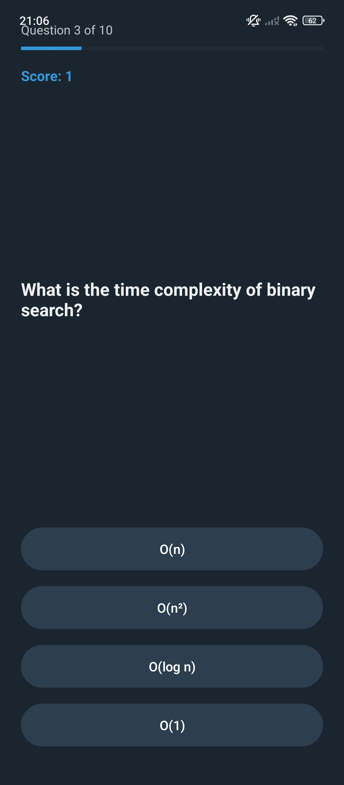

# CS Quiz App — Android

An Android quiz application built in Java that tests knowledge of core Computer Science concepts. Features 10 questions with multiple choice answers, instant feedback, score tracking, and a final results screen.

## Screenshots

  
  &nbsp;&nbsp;
  
  &nbsp;&nbsp;
  

## Features

- 10 multiple-choice CS questions
- Instant color feedback — green for correct, red for wrong
- Score tracked throughout the quiz
- Progress bar showing how far through the quiz you are
- Final results screen with performance grade
- Restart functionality

## Topics Covered in the Quiz

- Computer architecture (CPU, RAM)
- Data structures (Stack, Queue)
- Algorithms and time complexity
- Programming languages
- Web technologies
- Networking basics

## How to Run

1. Clone this repository
2. Open the project in **Android Studio**
3. Add `MainActivity.java` to `app/src/main/java/com/example/quizapp/`
4. Replace `app/src/main/res/layout/activity_main.xml` with the provided layout file
5. Run on an emulator or physical Android device (Android 7.0+ / API 24+)

## What I Learned

This project helped me practice Java OOP, Android Activity lifecycle, event handling with `OnClickListener`, and dynamic UI updates. I also learned how to use `Handler` to delay UI changes and improve the user experience.

## Technologies

Java · Android Studio · XML Layouts · Android SDK
